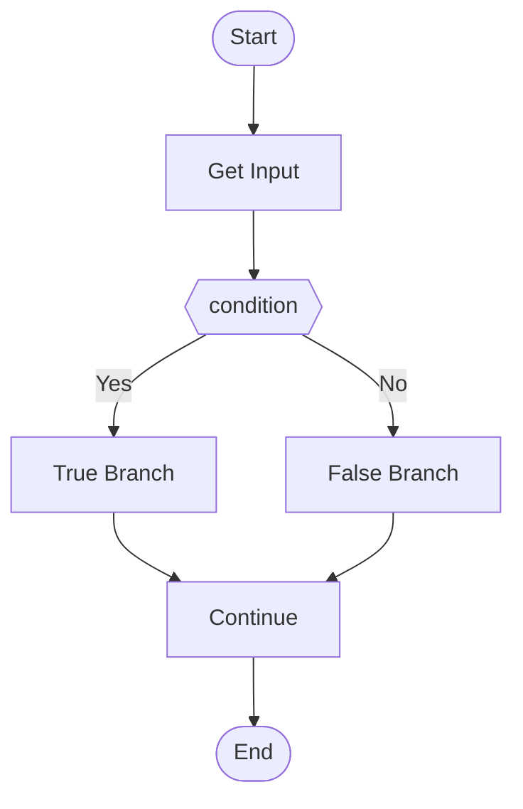
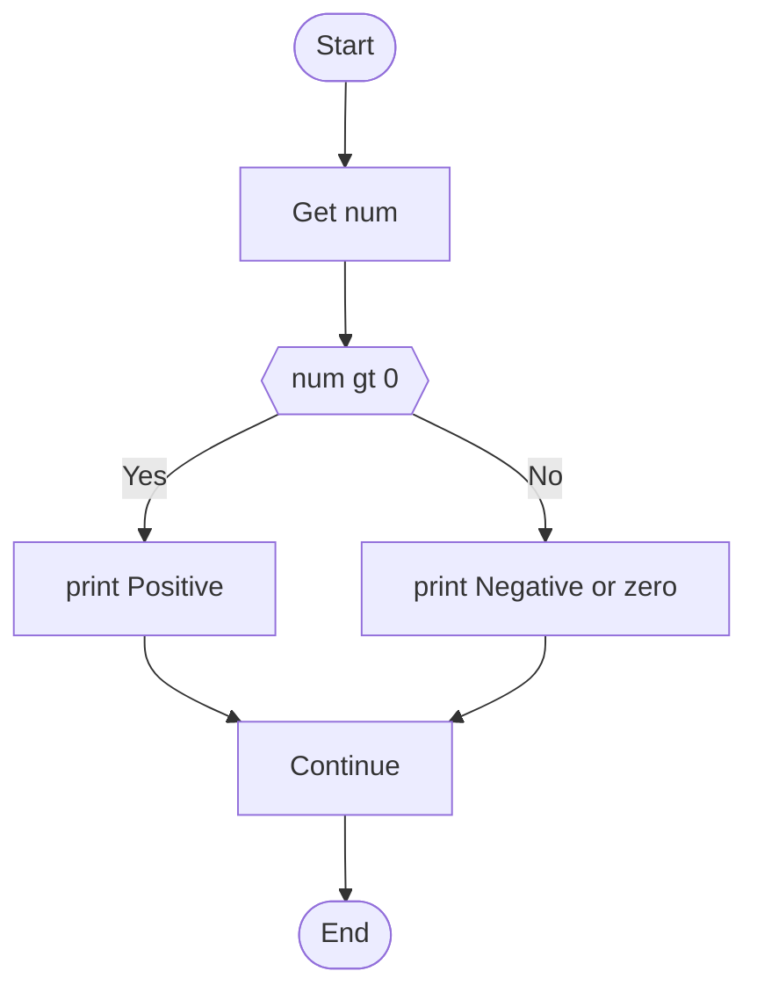

# Mermaid Diagram Generation Improvements

## Date: March 9, 2026

## Problem
Mermaid diagrams were generating but arrows and logical flows were missing accuracy. The logic flow was not properly representing the actual code structure, especially for conditional branches.

## Solution Implemented

### 1. Enhanced Code Structure Analysis
- **New `_analyze_code_structure` method** with proper flow tracking
- Tracks indentation levels to understand nested structures
- Identifies what operations happen inside if/else branches
- Maintains sequential flow order

### 2. Improved Flow Tracking
Added new `flow` array to analysis that tracks:
- Input operations
- Calculations/operations
- Conditional branches (with actual content in each branch)
- Output operations
- Return statements

### 3. Accurate Branch Content
- True branches now show actual operations (e.g., "print Positive")
- False branches show actual operations (e.g., "print Negative or zero")
- No more generic "True Branch" / "False Branch" labels

### 4. Better Character Cleaning
New `_clean_display_text` helper method that:
- Removes special characters that break Mermaid syntax
- Converts operators to text (+ → plus, * → times)
- Handles brackets, parentheses, quotes properly

## Results

### Before:

### After:

## Key Improvements
1. ✅ Accurate logic flow representation
2. ✅ Proper arrow connections from Start to End
3. ✅ Actual branch content displayed
4. ✅ Sequential flow maintained
5. ✅ Special characters properly cleaned

## Testing
Tested with:
- Simple arithmetic (sum of two numbers)
- Single condition (positive/negative check)
- Nested conditions (password validation)

All tests passed successfully with accurate flow diagrams generated.

## Files Modified
- `CODE_AGENT/backend/services/ollama_service.py`
  - Enhanced `_analyze_code_structure` method
  - Improved `generate_mermaid` method
  - Added `_clean_display_text` helper method
